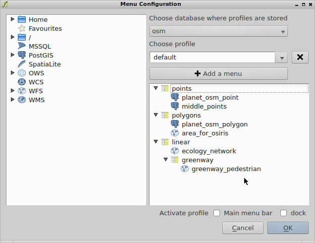
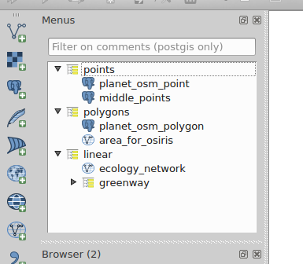

Qgis Menu Builder
=================

A QGIS plugin for creating menus with your favorite layers.
You can create several profiles with custom hierarchical menus.
Profiles are stored in postgresql for convenience.
Configuration is made easy by drag & drop from the qgis browser.

Installation from QGIS plugin repository
----------------------------------------

This plugin is available in the official QGIS plugin repository.
You can install it directly from within QGIS, thanks to the extension manager.

http://plugins.qgis.org/plugins/MenuBuilder/

Installation from github
------------------------

::

    cd .qgis2/python/plugins/
    git clone https://github.com/Oslandia/qgis-menu-builder

Using the plugin
----------------

Check that the plugin 'Menu Builder' is activated in the plugin manager.

Go to Plugins -> Menu Builder -> Configure Menus

* Select a database from where to store metadata
* Choose an existing profile in the list below or write a profile name for the first time
* Create menus by pressing "add menu"
* Start to drag & drop some layers from the left tree view (qgis browser) to the right
* You can select several layers at the same time before dragging (press Shift to do it)
* Moving layers internaly on the right is possible by pressing Shift key before dragging
* Once configuration of the menus is done, just press Ok to save it to postgres
* If you want to use a dock widget or insert menus in the main menu bar, check corresponding boxes before Ok
* The dock widget has a filter operating on postgresql comments

Available translations: French

Preview
-------

Credits
=======

This plugin has been developed by Oslandia (http://www.oslandia.com).

Oslandia provides support and assistance for QGIS and associated tools, including this plugin.

This work has been funded by The French Ministry of Ecology, Sustainable Development and Energy (DREAL Rhône-Alpes).

License
=======

This work is free software and licenced under the GNU GPL version 2 or any later version.
See LICENSE file.
